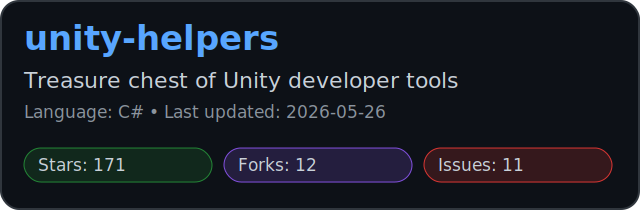
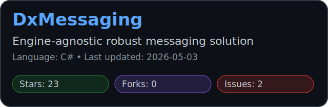
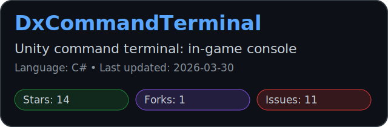
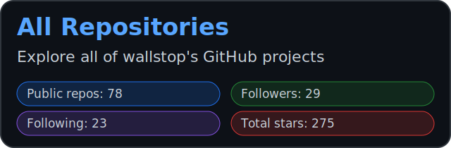

<h1 align="center">Wallstop</h1>

<strong>Builder. Creator.</strong>

  
  
  

---

## About

I have several man-decades of technical and people experience across games, tools, websites, large-scale team and organization coordination, globally distributed systems - the list goes on.

---

## GitHub Snapshot

  
  

  

---

## Featured Projects

  
  

  
  

---

## Connect

I love building cool stuff, connecting with people, and providing feedback. If that sounds useful, reach out.
